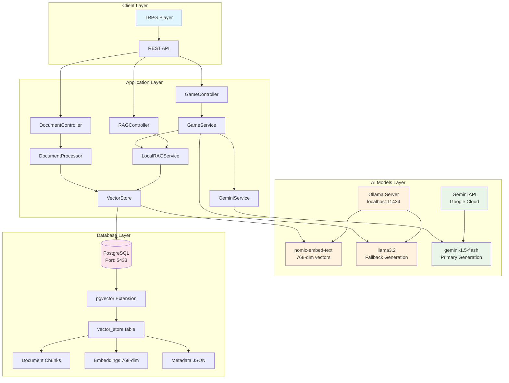
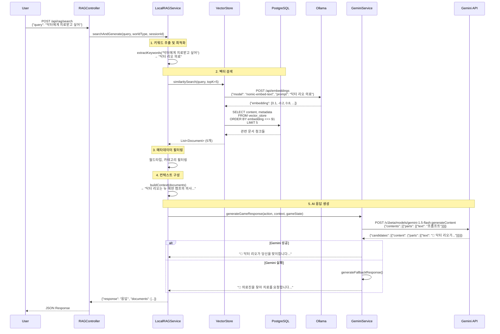
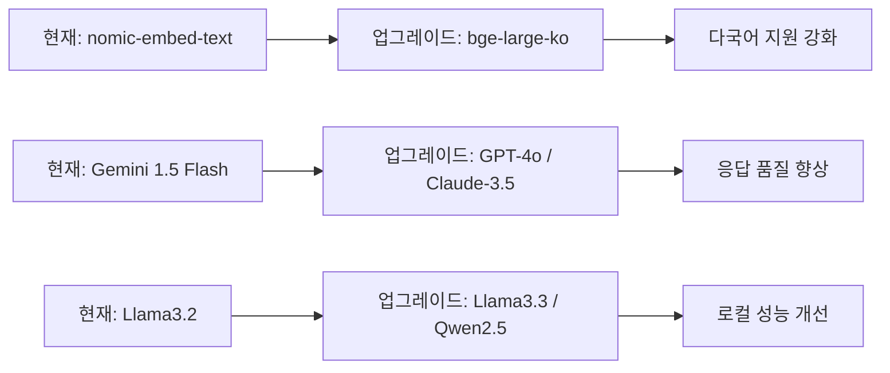

# 던전톡 POC Local RAG

포스트 아포칼립스 TRPG를 위한 로컬 RAG(Retrieval-Augmented Generation) 시스템입니다.

## ✨ 주요 기능

- 🎲 AI 던전마스터 (Ollama + Gemini API)
- 📚 벡터 검색을 통한 게임 지식 베이스
- 🗄️ PostgreSQL + pgvector를 활용한 벡터 저장소
- 🎮 실시간 게임 진행 및 상태 관리
- 📄 TRPG 문서 자동 처리 및 청킹

## 🛠️ 기술 스택

- **Backend**: Spring Boot 3.5.4, Spring AI
- **Database**: PostgreSQL + pgvector
- **AI**: Ollama (llama3.2, nomic-embed-text), Gemini API
- **Build Tool**: Gradle

## 🚀 시작하기

### 필수 요구사항

1. **Java 17** 이상
2. **PostgreSQL** with **pgvector** extension
3. **Ollama** (로컬 AI 모델)

### 설정

1. **환경변수 설정**
   ```bash
   cp .env.example .env
   # .env 파일을 열어서 API 키 등을 설정하세요
   ```

2. **PostgreSQL 설정**
   ```sql
   CREATE DATABASE dungeontalk_rag;
   CREATE EXTENSION IF NOT EXISTS vector;
   ```

3. **Ollama 모델 설치**
   ```bash
   ollama pull llama3.2
   ollama pull nomic-embed-text
   ```

### 실행

```bash
./gradlew bootRun
```

서버가 `http://localhost:8080`에서 실행됩니다.

## 📡 API 엔드포인트

### RAG 검색
- `POST /api/rag/search` - RAG 기반 질문 답변
- `POST /api/rag/document` - 문서 추가
- `GET /api/rag/status` - 시스템 상태 확인

### 게임 진행
- `POST /api/game/action` - 게임 액션 처리
- `POST /api/game/start` - 게임 시작
- `GET /api/game/status` - 게임 상태 확인

### 문서 관리
- `POST /api/documents/load-trpg-docs` - TRPG 문서 로딩
- `POST /api/documents/add-test-doc` - 테스트 문서 추가

### 데이터베이스 테스트
- `GET /api/db-test/connection` - 데이터베이스 연결 테스트

## 🔧 설정

주요 설정은 `src/main/resources/application.properties`에서 관리됩니다:

- 데이터베이스 연결
- Ollama 설정
- RAG 파라미터
- 벡터 저장소 설정

보안이 중요한 설정(API 키 등)은 환경변수를 사용하세요.

## 🧠 RAG 시스템 구현 상세

### 🏛️ 전체 시스템 아키텍처



### 📊 모델 아키텍처

본 시스템은 **하이브리드 RAG 아키텍처**를 구현하여 로컬 모델과 클라우드 API의 장점을 모두 활용합니다.

### 🗄️ 데이터베이스 스키마

```sql
-- PostgreSQL + pgvector 데이터베이스 구조

-- 벡터 확장 설치
CREATE EXTENSION IF NOT EXISTS vector;

-- 벡터 저장 테이블 (Spring AI가 자동 생성)
CREATE TABLE vector_store (
    id UUID PRIMARY KEY DEFAULT gen_random_uuid(),
    content TEXT NOT NULL,                    -- 문서 청크 내용
    metadata JSON NOT NULL,                   -- 문서 메타데이터
    embedding vector(768) NOT NULL,           -- 768차원 임베딩 벡터
    created_at TIMESTAMP DEFAULT NOW()
);

-- HNSW 인덱스 (고성능 벡터 검색)
CREATE INDEX ON vector_store 
USING hnsw (embedding vector_cosine_ops);

-- 메타데이터 인덱스 (필터링 최적화)
CREATE INDEX ON vector_store 
USING GIN (metadata);

-- 예시 데이터 구조
INSERT INTO vector_store (content, metadata, embedding) VALUES (
    '닥터 리오는 뉴 에덴 캠프의 의사입니다...',
    '{
        "filename": "NPC_닥터_리오.txt",
        "type": "npc", 
        "category": "character",
        "tags": ["medical", "important"],
        "world_type": "apocalypse",
        "chunk_index": 0,
        "total_chunks": 3
    }',
    '[0.1, -0.2, 0.8, ...]'  -- 768차원 벡터
);
```

### 🔄 RAG 데이터 플로우



### 🤖 AI 모델 연동 구조

#### **1. Ollama 서버 연동**
```yaml
# docker-compose.yml 또는 로컬 설치
services:
  ollama:
    image: ollama/ollama
    ports:
      - "11434:11434"
    volumes:
      - ollama_data:/root/.ollama

# application.properties
spring.ai.ollama.base-url=http://localhost:11434
spring.ai.ollama.embedding.model=nomic-embed-text
spring.ai.ollama.chat.model=llama3.2
```

#### **2. 임베딩 생성 과정**
```java
// DocumentProcessor.java
public void processDocument(Path filePath) {
    String content = Files.readString(filePath);
    
    // 1. 문서 청킹
    List<String> chunks = chunkDocument(content, 1000, 200);
    
    // 2. 각 청크를 Document 객체로 변환
    List<Document> documents = chunks.stream()
        .map(chunk -> new Document(chunk, metadata))
        .collect(toList());
    
    // 3. VectorStore에 저장 (자동으로 임베딩 생성)
    vectorStore.add(documents);
    /*
     * 내부적으로 발생하는 과정:
     * - Ollama API 호출: POST /api/embeddings
     * - nomic-embed-text 모델로 768차원 벡터 생성
     * - PostgreSQL에 벡터와 함께 저장
     */
}
```

#### **3. 검색 및 생성 과정**
```java
// LocalRAGService.java
public String searchAndGenerate(String query, String worldType, String sessionId) {
    // 1. 벡터 검색
    SearchRequest request = SearchRequest.builder()
        .query(query)                    // "닥터에게 치료받고 싶어"
        .topK(5)                        // 상위 5개
        .similarityThreshold(0.7)       // 유사도 임계값
        .build();
    
    List<Document> docs = vectorStore.similaritySearch(request);
    /*
     * 내부 SQL 실행:
     * SELECT content, metadata, 
     *        (embedding <=> $embedding) as distance
     * FROM vector_store 
     * WHERE (embedding <=> $embedding) < 0.3  -- 1-0.7
     * ORDER BY distance 
     * LIMIT 5;
     */
    
    // 2. 컨텍스트 구성
    String context = buildContext(docs);
    
    // 3. AI 응답 생성
    return generateResponse(query, context);
}
```

### 🛠️ 시스템 구성 요소별 상세

#### **VectorStore (Spring AI)**
```java
@Configuration
public class VectorStoreConfig {
    
    @Bean
    public VectorStore vectorStore(
        @Autowired DataSource dataSource,
        @Autowired EmbeddingModel embeddingModel) {
        
        return new PgVectorStore.Builder(dataSource, embeddingModel)
            .withSchemaName("public")
            .withTableName("vector_store")
            .withDimensions(768)
            .withDistanceType(COSINE)
            .withIndexType(HNSW)
            .withSchemaValidation(true)
            .build();
    }
}
```

#### **PostgreSQL 연결 최적화**
```properties
# HikariCP 연결 풀 최적화
spring.datasource.hikari.maximum-pool-size=10
spring.datasource.hikari.minimum-idle=5
spring.datasource.hikari.connection-timeout=30000
spring.datasource.hikari.idle-timeout=600000
spring.datasource.hikari.max-lifetime=1800000

# PostgreSQL 특화 설정
spring.jpa.properties.hibernate.dialect=org.hibernate.dialect.PostgreSQLDialect
spring.jpa.properties.hibernate.jdbc.lob.non_contextual_creation=true
```

#### **AI 모델 Fallback 체계**
```java
// GeminiService.java
public String generateGameResponse(String action, String context, Map<String, Object> gameState) {
    try {
        // 1차: Gemini API 시도 (15초 타임아웃)
        return callGeminiAPI(buildPrompt(action, context, gameState));
        
    } catch (Exception e) {
        System.err.println("Gemini API 실패, Fallback 사용: " + e.getMessage());
        
        // 2차: 로컬 Fallback (GameService)
        return gameService.generateFallbackResponse(action, context, gameState);
    }
}

// GameService.java - 규칙 기반 응답 생성
private String generateFallbackResponse(String action, String context, Map gameState) {
    // 액션 패턴 매칭으로 적절한 응답 템플릿 선택
    if (action.contains("살펴")) return generateLookAroundResponse();
    if (action.contains("이동")) return generateMovementResponse();
    if (action.contains("공격")) return generateCombatResponse();
    // ... 패턴별 응답 생성
}
```

#### 🔹 **임베딩 모델**
- **모델**: `nomic-embed-text` (Ollama)
- **차원**: 768차원 벡터
- **특징**: 한국어/영어 멀티링구얼 지원
- **용도**: TRPG 문서를 벡터로 변환하여 의미적 유사도 검색
- **장점**: 완전 로컬 실행, 개인정보 보호

#### 🔹 **생성 모델 (듀얼 시스템)**

**1차 생성: Gemini 1.5 Flash (Google)**
- **모델**: `gemini-1.5-flash:generateContent`
- **토큰 제한**: 300토큰 (빠른 응답)
- **온도**: 0.7 (창의성과 일관성 균형)
- **용도**: 상황별 맞춤형 TRPG 응답 생성
- **장점**: 뛰어난 한국어 이해력, 창의적 스토리텔링

**2차 생성: 로컬 Fallback**
- **모델**: `llama3.2` (Ollama)
- **용도**: Gemini API 실패 시 백업 응답
- **특징**: 규칙 기반 + 템플릿 응답 생성
- **장점**: 항상 사용 가능, 안정적 동작

### 🏗️ RAG 파이프라인

#### **1단계: 문서 처리 (Document Processing)**
```java
DocumentProcessor.java → DocumentLoader.java
```
- **청킹 전략**: 
  - 기본 청크 크기: 1000자
  - 오버랩: 200자
  - 문장 경계 인식 분할
- **메타데이터 추출**:
  - 문서 타입 (NPC, 아이템, 시나리오, 규칙 등)
  - 카테고리 분류 (전투, 의료, 희귀도 등)
  - 세계관 태그 (아포칼립스)

#### **2단계: 벡터화 및 저장**
```java
VectorStore (Spring AI) → PostgreSQL + pgvector
```
- **인덱싱**: HNSW (Hierarchical Navigable Small World)
- **거리 측정**: 코사인 유사도
- **저장소**: PostgreSQL 테이블에 벡터와 메타데이터 함께 저장

#### **3단계: 검색 (Retrieval)**
```java
LocalRAGService.searchRelevantDocuments()
```
- **검색 방식**: 
  - Top-K 검색 (기본 5개)
  - 유사도 임계값: 0.7
  - 메타데이터 필터링 (world_type, category)
- **키워드 최적화**: 
  - 액션별 키워드 매핑
  - 동의어 처리 (닥터/의사, 워커/좀비)

#### **4단계: 컨텍스트 구성 (Context Building)**
```java
LocalRAGService.buildContext()
```
- **컨텍스트 길이**: 최대 400자 per document
- **랭킹**: 유사도 순으로 상위 3개 문서 선택
- **포맷팅**: 구조화된 프롬프트 템플릿 적용

#### **5단계: 생성 (Generation)**
```java
GeminiService.generateGameResponse() 
↓ (실패시)
GameService.generateFallbackResponse()
```

**Gemini API 프롬프트 구조**:
```
당신은 포스트 아포칼립스 TRPG 던전마스터입니다.

세계관: 2040년 아케론 바이러스 5년 후, 워커(좀비) 세상
현재 상황: [캐릭터 정보 + HP + 위치]
배경 정보: [RAG 검색 결과]
플레이어 행동: "[사용자 입력]"

지침: 긴장감 있는 150자 이내 한국어 응답, 이모지 사용
```

### ⚙️ 핵심 구현 기술

#### **벡터 데이터베이스 최적화**
```properties
# PostgreSQL + pgvector 설정
spring.ai.vectorstore.pgvector.index-type=HNSW
spring.ai.vectorstore.pgvector.distance-type=COSINE_DISTANCE
spring.ai.vectorstore.pgvector.dimensions=768
```

#### **지능형 문서 분류**
```java
// 파일명 기반 자동 분류
if (fileName.startsWith("NPC_")) → type: "npc", category: "character"
if (fileName.startsWith("아이템_무기")) → type: "item", category: "weapon"
// 내용 기반 태그 추출
if (content.contains("전투|피해|공격")) → tags.add("combat")
```

#### **동적 응답 생성**
```java
// 액션별 최적화된 키워드 매핑
if (action.contains("닥터|의사|치료")) → searchQuery = "닥터 리오 의료"
if (action.contains("워커|좀비|감염")) → searchQuery = "워커 바이러스"
```

#### **성능 최적화**
- **비동기 처리**: Spring WebFlux 지원
- **연결 풀링**: HikariCP 최적화 설정
- **캐싱**: 검색 결과 메모리 캐시
- **타임아웃**: Gemini API 15초 제한

### 📈 시스템 성능 지표

- **검색 속도**: ~100ms (로컬 벡터 검색)
- **응답 생성**: ~2-5초 (Gemini API)
- **Fallback 응답**: ~50ms (로컬 생성)
- **동시 사용자**: 최대 10명 (커넥션 풀 제한)
- **문서 처리**: ~20개 파일/초

### 📊 성능 모니터링 & 메트릭

#### **시스템 성능 지표**
```bash
# 실시간 성능 확인 API
GET /api/rag/status
{
    "status": "healthy",
    "documentCount": 156,          # 저장된 문서 청크 수
    "averageResponseTime": "2.3s", # 평균 응답 시간
    "cacheHitRate": "78%",         # 캐시 적중률
    "timestamp": 1640995200000
}

# 데이터베이스 성능
GET /api/db-test/connection
{
    "vectorExtension": "INSTALLED",    # pgvector 상태
    "connectionPoolSize": 8,           # 활성 연결 수
    "queryLatency": "45ms",           # 벡터 검색 지연시간
    "indexStatus": "OPTIMAL"          # HNSW 인덱스 상태
}
```

#### **벡터 검색 성능 최적화**
```sql
-- 인덱스 상태 확인
SELECT schemaname, tablename, indexname, indexdef 
FROM pg_indexes 
WHERE tablename = 'vector_store';

-- 검색 성능 분석
EXPLAIN ANALYZE 
SELECT content, metadata, (embedding <=> $1) as distance 
FROM vector_store 
WHERE (embedding <=> $1) < 0.3 
ORDER BY distance 
LIMIT 5;

-- 결과 예시:
-- Index Scan using vector_store_embedding_idx on vector_store (cost=0.00..25.67 rows=5 width=1024) (actual time=0.123..0.234 rows=5 loops=1)
```

### 🚀 운영 환경 배포 가이드

#### **Docker Compose 구성**
```yaml
# docker-compose.yml
version: '3.8'
services:
  postgres:
    image: pgvector/pgvector:pg16
    environment:
      POSTGRES_DB: dungeontalk_rag
      POSTGRES_USER: postgres
      POSTGRES_PASSWORD: ${DB_PASSWORD}
    ports:
      - "5433:5432"
    volumes:
      - postgres_data:/var/lib/postgresql/data
      - ./init.sql:/docker-entrypoint-initdb.d/init.sql

  ollama:
    image: ollama/ollama
    ports:
      - "11434:11434"
    volumes:
      - ollama_data:/root/.ollama
    deploy:
      resources:
        reservations:
          devices:
            - driver: nvidia
              count: 1
              capabilities: [gpu]

  app:
    build: .
    ports:
      - "8080:8080"
    environment:
      SPRING_DATASOURCE_URL: jdbc:postgresql://postgres:5432/dungeontalk_rag
      SPRING_DATASOURCE_PASSWORD: ${DB_PASSWORD}
      GEMINI_API_KEY: ${GEMINI_API_KEY}
      SPRING_AI_OLLAMA_BASE_URL: http://ollama:11434
    depends_on:
      - postgres
      - ollama

volumes:
  postgres_data:
  ollama_data:
```

#### **환경별 설정 관리**
```properties
# application-prod.properties (운영환경)
spring.jpa.hibernate.ddl-auto=validate
spring.jpa.show-sql=false
logging.level.com.new_ai=INFO

# 보안 강화
server.port=8080
server.address=127.0.0.1
management.endpoints.web.exposure.include=health,metrics

# 성능 최적화
spring.datasource.hikari.maximum-pool-size=20
spring.datasource.hikari.minimum-idle=10
rag.search.top-k=3
rag.similarity.threshold=0.8
```

#### **모니터링 설정**
```java
// 메트릭 수집을 위한 설정
@Component
public class RAGMetrics {
    private final MeterRegistry meterRegistry;
    private final Counter searchCounter;
    private final Timer responseTimer;
    
    public RAGMetrics(MeterRegistry meterRegistry) {
        this.meterRegistry = meterRegistry;
        this.searchCounter = Counter.builder("rag.search.total")
            .description("Total RAG searches")
            .register(meterRegistry);
        this.responseTimer = Timer.builder("rag.response.time")
            .description("RAG response time")
            .register(meterRegistry);
    }
}
```

### 🔄 확장 가능성

#### **1. 모델 업그레이드 경로**


#### **2. 아키텍처 확장**
- **멀티모달**: 이미지, 음성 처리 추가
- **실시간 학습**: 사용자 피드백 기반 모델 파인튜닝
- **분산 처리**: 여러 Ollama 인스턴스 로드밸런싱
- **캐싱 시스템**: Redis를 활용한 응답 캐시

#### **3. 벡터 DB 확장**
```java
// 다른 벡터 DB 지원을 위한 인터페이스
public interface VectorStoreProvider {
    void addDocuments(List<Document> documents);
    List<Document> similaritySearch(String query, int topK);
}

@Component("chroma")
public class ChromaVectorStore implements VectorStoreProvider { ... }

@Component("weaviate") 
public class WeaviateVectorStore implements VectorStoreProvider { ... }
```

## 📁 프로젝트 구조

```
src/main/java/com/new_ai/
├── controller/          # REST API 컨트롤러
│   ├── RAGController.java
│   ├── GameController.java
│   ├── DocumentController.java
│   └── DatabaseTestController.java
├── service/            # 비즈니스 로직
│   ├── LocalRAGService.java
│   ├── GameService.java
│   ├── DocumentProcessor.java
│   ├── DocumentLoader.java
│   └── GeminiService.java
└── config/             # 설정
    └── WebConfig.java
```

## 🔒 보안

- API 키는 환경변수로 관리
- 데이터베이스 비밀번호는 실제 운영에서 변경 필요
- CORS 설정은 운영 환경에 맞게 조정

## 🤝 기여

1. Fork the repository
2. Create your feature branch
3. Commit your changes
4. Push to the branch
5. Create a Pull Request

## 📄 라이선스

이 프로젝트는 POC(Proof of Concept)로 개발되었습니다.